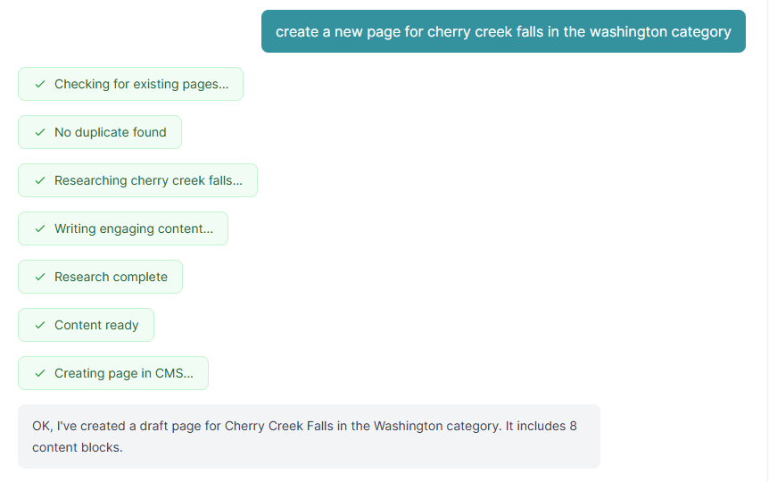
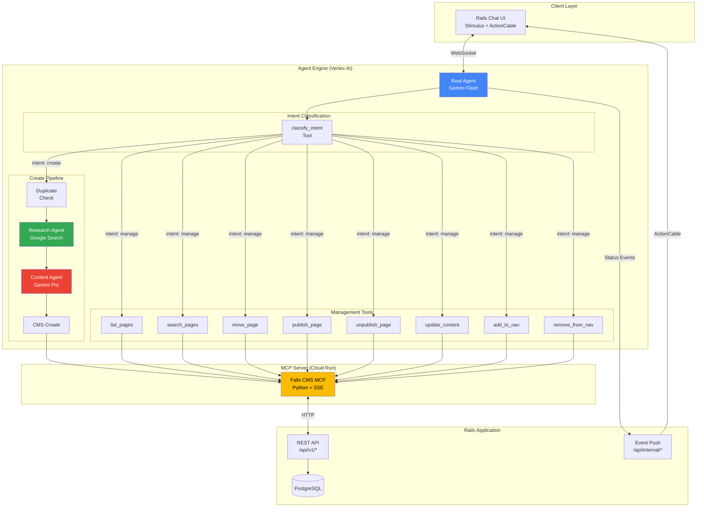
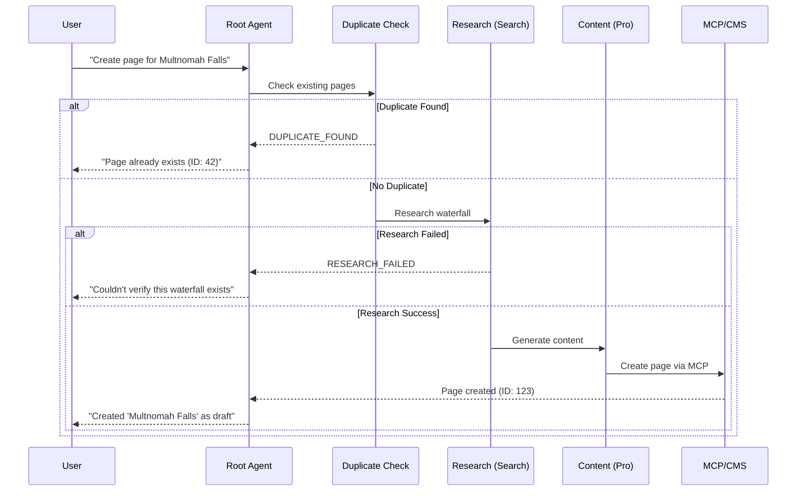

# Falls CMS Agent

> An AI agent that researches, writes, and publishes waterfall hiking guides—turning a 2-hour content creation process into a 60-second conversation.

Built with [Google's Agent Development Kit (ADK)](https://google.github.io/adk-docs/) for the [Kaggle Agents Intensive Capstone](https://www.kaggle.com/competitions/agents-intensive-capstone-project).



## The Problem

Creating quality content for a hiking/travel blog is tedious:

1. **Research** (30+ min): Search for GPS coordinates, trail distance, elevation gain, difficulty ratings, seasonal info
2. **Write** (60+ min): Transform facts into engaging content with consistent voice/tone
3. **Publish** (15+ min): Navigate CMS, fill forms, set metadata, organize hierarchy

For a site cataloging hundreds of waterfalls, this doesn't scale.

## The Solution

A conversational agent that handles the entire workflow:

```
User: "Create a page for Cherry Creek Falls in Washington"

Agent: ✓ Checking for existing pages...
       ✓ Researching Cherry Creek Falls...
       ✓ Writing engaging content...
       ✓ Creating page in CMS...

       Done! Created 'Cherry Creek Falls' as a draft under 'Washington'
       with 8 content blocks.
```

And it doesn't stop at creation. The agent manages your entire content lifecycle:

```
User: "Publish Cherry Creek Falls and add it to the primary nav"

Agent: ✓ Published Cherry Creek Falls
       ✓ Added to Primary Nav

       Done! Cherry Creek Falls is now live and visible in your header navigation.
```

**One sentence in, published page out.**

---

## ADK Features Demonstrated

This project demonstrates **7 key concepts**:

| Feature | Implementation |
|---------|----------------|
| **Multi-Agent System** | Root agent orchestrates router + create pipeline + 12 management tools |
| **Tools (MCP)** | 15 MCP tools for full CMS lifecycle: create, publish, move, nav management |
| **Tools (Google Search)** | Research agent uses `google_search_retrieval` for grounded facts |
| **Sessions & State** | ADK sessions with `user_id` for real-time event streaming to UI |
| **Observability** | OpenTelemetry tracing enabled for debugging and monitoring |
| **Agent Evaluation** | ADK AgentEvaluator + Vertex AI Gen AI Evaluation Service |
| **Agent Deployment** | Production deployment on Vertex AI Agent Engine + Cloud Run |

### Multi-Model Orchestration

The agent uses different Gemini models for different tasks:

- **Gemini Flash** (`gemini-2.0-flash`): Fast intent classification and routing
- **Gemini Pro** (`gemini-2.5-pro-preview-05-06`): High-quality content generation

This pattern optimizes for both speed (sub-second routing) and quality (nuanced writing).

---

## Architecture



### Component Responsibilities

| Component | Role | Key Design Decision |
|-----------|------|---------------------|
| **Root Agent** | Orchestration | Calls `classify_intent` first, then dispatches to appropriate pipeline/tool |
| **Router** | Intent classification | Gemini Flash for sub-second classification into create/manage/query |
| **Research Agent** | Fact gathering | Google Search grounding ensures real data, not hallucinations |
| **Content Agent** | Writing | Gemini Pro for quality; structured output via Pydantic schemas |
| **MCP Server** | CMS bridge | Stateless, deployed on Cloud Run; translates MCP calls to REST |
| **Rails Events** | Real-time UX | HTTP POST to Rails, which broadcasts via ActionCable |

---

## The Create Pipeline

The page creation workflow is a **sequential pipeline** with validation gates:



### Pipeline Guardrails

1. **Duplicate Detection**: Prevents creating redundant pages
2. **Research Validation**: Stops if the waterfall can't be verified (no fake content)
3. **Structured Output**: Pydantic schemas ensure valid JSON for CMS API

---

## Management Operations

Beyond page creation, the agent handles the full content management lifecycle:

| Operation | Example Prompt | What It Does |
|-----------|----------------|--------------|
| **Publish** | "Publish Cherry Creek Falls" | Makes a draft page live |
| **Unpublish** | "Unpublish the Watson Falls page" | Reverts to draft status |
| **Move** | "Move Toketee Falls under Highway 138" | Reorganizes page hierarchy |
| **Rename** | "Rename 'Multnomah Falls Oregon' to 'Multnomah Falls'" | Updates page title |
| **Update Content** | "Update the hiking tips on Multnomah Falls to mention the trail closure" | Modifies specific content blocks |
| **Add to Nav** | "Add Waterfalls to the Primary Nav" | Places page in header navigation |
| **Remove from Nav** | "Remove Oregon from the Footer Nav" | Removes page from navigation |
| **Search** | "Find pages about Oregon" | Searches by title or content |
| **List** | "What pages are under Washington?" | Lists pages with optional parent filter |
| **Get Details** | "Show me the Cherry Creek Falls page" | Displays full page info including blocks |

### Navigation Management

The agent intelligently handles navigation placement:

- **Case-insensitive matching**: "primary nav" → "Primary Nav"
- **Partial matching**: "primary" → "Primary Nav", "footer" → "Footer Nav"
- **Idempotent operations**: Adding to a nav when already present returns success (not error)
- **Helpful errors**: Invalid nav names return available options

```
User: "Add Oregon to the sidebar"

Agent: I couldn't find a navigation location called "sidebar".
       Available locations: Primary Nav, Footer Nav
```

---

## Real-Time Status Updates

Users see step-by-step progress as the agent works:

```python
# Pipeline emits status events that stream to the UI
await emit_status("Researching Cherry Creek Falls...", "step_start")
# ... agent does work ...
await emit_status("Research complete", "step_complete")
```

Events flow: **Agent → HTTP POST → Rails → ActionCable → Browser**

The UI renders these as animated step bubbles with spinners and checkmarks.

---

## Content Voice

The content agent writes as a **GenX woman who genuinely loves waterfalls**:

- Personal & informative—like advice from a friend who's been there
- Practical—includes the info hikers actually need
- Slight sarcasm—doesn't take herself too seriously

> "Yes, you'll be sharing the trail with approximately 47,000 other people on a summer weekend. But trust me—when you round that corner and see 620 feet of cascading water, you'll forget every single one of them."

This voice is defined in `prompts/content.yaml` and applied consistently across all generated content.

---

## Project Structure

```
falls_cms_agent/
├── agent.py                 # Root agent definition
├── core/
│   ├── callbacks.py         # Status event emission
│   ├── config.py            # Environment configuration
│   ├── mcp_client.py        # MCP connection management
│   └── prompts.py           # YAML prompt loader
├── pipelines/
│   ├── create_page.py       # Page creation orchestration
│   ├── management.py        # 12 management tools (publish, move, nav, etc.)
│   └── router.py            # Intent classification (Gemini Flash)
├── common/
│   └── schemas.py           # Pydantic models (shared with MCP)
└── prompts/
    ├── root.yaml            # Root agent instructions
    ├── router.yaml          # Intent classification rules
    ├── research.yaml        # Research agent instructions
    └── content.yaml         # Content generation + voice
```

---

## Technical Decisions

### Why MCP Instead of Direct API Calls?

MCP (Model Context Protocol) provides:
- **Tool abstraction**: Agent sees `create_waterfall_page`, not HTTP details
- **Stateless bridge**: MCP server can be scaled independently
- **Interoperability**: Same MCP server could serve other agents/clients

### Why Sequential Pipeline Instead of Parallel?

Content creation is inherently sequential:
1. Must check duplicates before researching
2. Must research before writing
3. Must write before publishing

Parallel execution would create race conditions or require complex rollback logic.

### Why Two Gemini Models?

- **Flash for routing**: Intent classification doesn't need deep reasoning
- **Pro for content**: Writing quality matters; Pro produces more nuanced prose

This reduces costs by using the cheaper model for simple classification while reserving Pro for quality-sensitive content generation. (At the time of writing, Gemini 2.0 Flash costs $0.15/1M input tokens vs $1.25/1M for Gemini 2.5 Pro—an 88% reduction for routing calls. [Vertex AI Pricing](https://cloud.google.com/vertex-ai/generative-ai/pricing))

---

## Agent Evaluation

The project includes evaluation tests using ADK's AgentEvaluator framework to validate agent behavior.

### Running Evaluations

```bash
# Run all evaluation tests
pytest tests/test_evaluations.py -v

# Run specific test
pytest tests/test_evaluations.py::test_intent_classification -v
```

**Expected results**: 6 passed, 1 skipped (~25 minutes runtime)

### Test Fixtures

Tests are defined as `.test.json` fixtures in `tests/fixtures/`:

| Fixture | Eval Cases | What It Tests |
|---------|------------|---------------|
| `duplicate_detection.test.json` | 1 | Pipeline stops when page already exists |
| `fake_waterfall_rejection.test.json` | 1 | Research agent rejects fictional waterfalls |
| `intent_classification.test.json` | 6 | Router correctly classifies user intents |
| `page_management.test.json` | 3 | Move, publish, and error handling for pages |
| `list_and_search.test.json` | 2 | List and search operations work correctly |
| `conversational.test.json` | 2 | Help requests and clarification (SKIPPED) |
| `all_recorded.test.json` | 8 | Comprehensive test of recorded trajectories |
| `nav_location.test.json` | — | Add/remove nav location operations (PLANNED) |

### Evaluation Thresholds

Thresholds are configured in `tests/fixtures/test_config.json`:

```json
{
  "criteria": {
    "tool_trajectory_avg_score": 0.8,
    "response_match_score": 0.3
  }
}
```

- **tool_trajectory_avg_score: 0.8** — Allows minor variations in tool call sequences. The agent may call additional tools or use slightly different arguments while still achieving the correct outcome.

- **response_match_score: 0.3** — LLM responses vary significantly between runs. We only require semantic similarity, not exact text matching.

### Why Conversational Tests Are Skipped

The `test_conversational` test is intentionally skipped because:

1. **Non-deterministic behavior**: For help requests and clarification scenarios, the agent sometimes responds directly without calling tools, and sometimes calls `classify_intent` first. Both behaviors are valid.

2. **Not a regression indicator**: Variability in conversational responses doesn't indicate a bug—it's expected LLM behavior.

The core functionality tests (intent classification, page creation, management operations) are deterministic and provide reliable regression testing.

### Recording New Trajectories

To record actual agent behavior for new test cases:

```bash
# Record trajectories (requires live agent connection)
python scripts/record_trajectories.py --format raw -o tests/trajectories/output.json
```

Recorded trajectories can be converted to fixtures by extracting the `tool_uses` from the agent's responses.

---

## Project Journey

This project evolved through several iterations:

1. **v1**: Single agent with all capabilities → Hard to test, prompts too long
2. **v2**: Multi-agent with handoffs → Complex state management
3. **v3**: Tools-as-Pipelines pattern → Current architecture, testable and maintainable

Key learnings:
- **Structured output** (Pydantic schemas) eliminated parsing errors
- **Event streaming** transformed UX from "waiting..." to visible progress
- **Multi-model** pattern balanced cost and quality effectively

---

## Related Projects

- **[Falls MCP Server](https://github.com/jasononaquest/fil-mcp)**: MCP bridge to Rails API

---

## License

MIT License

Copyright (c) 2025 Jason Harrison

---

## Acknowledgments

Built during the [Google & Kaggle AI Agents Intensive](https://www.kaggle.com/learn-guide/5-day-agents) (November 2025).

Thanks to the ADK team for excellent documentation and the course instructors for the architectural patterns that shaped this project.
